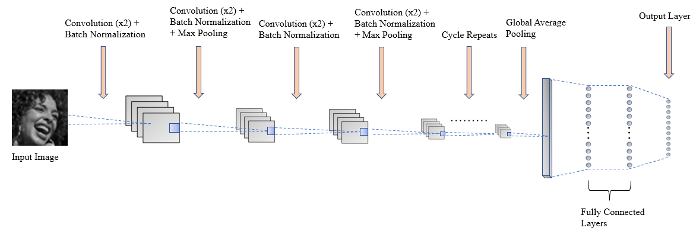

# Facial-Emotion-Recognition
An implementation of Facial Emotion Recognition using CNNs and transformer-based models like ViT (2021), ConvNeXT (2022), and ConvNeXTv2 (2023)

## Demo

Source: <a href = "https://www.kaggle.com/datasets/deadskull7/fer2013">Original YouTube Video</a>

Results after the above source video is passed through one of the trained models (ViT to be specific):

## Running the video inference locally

- Firstly run <code>pip install -r requirements.txt</code> to install all dependencies.
- Then run:
  
  <code>python video_inference.py --model_to_use=0 --enable_real_time_video_inferencing=True</code> for real-time video inferencing

  (OR)

  <code>python video_inference.py --model_to_use=0 --prerecorded_video_path=<path_to_video></code> for video inferencing on pre-recorded videos
  

## Dataset

The dataset used for this project is taken from Kaggle (<a href = "https://www.kaggle.com/datasets/deadskull7/fer2013">dataset</a>).

The dataset consists of approximately 36k, 48x48 pixel grayscale facial images labeled with seven different emotions: <code>anger, disgust, fear, happiness, sadness, surprise, and neutral</code>. Each of the ~36k images belongs to one of the 3 groups: Training (serves as the train set), PublicTest (serves as the validation set), PrivateTest (serves as the test set).

|    Group    | No. of Images |
|:-----------:|:-------------:|
|   Training  |     28709     |
|  PublicTest |      3589     |
| PrivateTest |      3589     |

## Models Trained

### 1) CNN

#### Network Architecture

The network architecture for the CNN used is given below:

Using this CNN, 2 experiments are performed: one without data augmentation, and one with data augmentation.

### 2) ViT

Used the pretrained “google/vit-base-patch16-224” model from HuggingFace and added a new classification head for the final classification. Trained the model on Colab and deployed it on HuggingFace (<a href = "https://huggingface.co/Aaryan333/vit-base-finetuned-fer2013">link</a>)

### 3) ConvNeXT

Used the pretrained “facebook/convnext-tiny-224” model from HuggingFace and added a new classification head for the final classification. Trained the model on Colab and deployed it on HuggingFace (<a href = "https://huggingface.co/Aaryan333/convnext-tiny-finetuned-fer2013">link</a>)

### 4) ConvNeXTv2

Used the pretrained “facebook/convnextv2-tiny-22k-384” model from HuggingFace and added a new classification head for the final classification. Trained the model on Colab and deployed it on HuggingFace (<a href = "https://huggingface.co/Aaryan333/convnextv2-tiny-384-finetuned-fer2013">link</a>)

## Results

The performance of various classifiers is shown below:

ViT has achieved the best results, and CNN with Data Augmentation is comparable to it. Note that ConvNeXTv2 has achieved relatively less scores because it was not fully trained as the other models (used a smaller batch size and trained only for 2 epochs) due to a lack of computational resources. Considering the progress of the other transformer models (ViT and ConvNeXT) at 2 epochs, ConvNeXTv2’s metrics were significantly better. This indicates that further training of ConvNeXTv2 with a larger batch size shall improve the results further.

## Tech Stack

* Tensorflow
* PyTorch
* Hugging Face
* OpenCV 

## Improvements

* Due to a lack of computational resources, the base/tiny version of the transformers was used. Using the larger versions of the same will help improve the performance further.
* Increasing the batch_size and the no. of epochs and further training can also help improve the metrics.

## Feedback

If you have any feedback or queries, feel free to reach me at: aaryan.nakhat@gmail.com

If you would like to connect/collaborate with me, do ping me up on Linkedln: <a href = "https://www.linkedin.com/in/aaryan-nak" target="_blank">Aaryan Nakhat</a>
